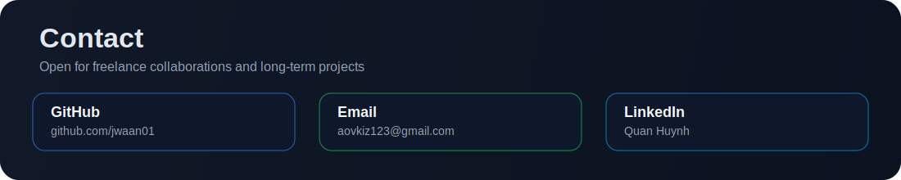

  

  

  
  
  

## About Me
- Freelance engineer delivering full-stack products for real clients.
- Strong in React frontend and Node.js backend with production mindset.
- Build fast, responsive, and maintainable systems with clear architecture.
- Comfortable across: C, C++, C#, Java, JavaScript, Python.

## Tech Arsenal

  

## Snake Game

  

## Freelance Services

  

## Contact

  

  
  
  

